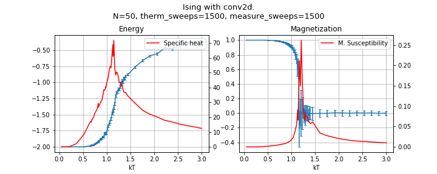

# Ising model in 3d and different masks

Jump to [presentation](analysis/Ising%20model%203d%20with%20masks.pdf) with description

1. 3d Ising model
2. 2d with anisotropy in interactions
3. 2d with diagonal anisotropy
4. Use conv2d torch layer for **50x** performance boost

### Some links
- Onsager, @yale, 1943: [2d model with tronsition](http://www.phys.ens.fr/~langlois/Onsager43.pdf)
- Yang et al, @google, 2019: [Simulation of Ising Modelon TPU Clusters](https://arxiv.org/pdf/1903.11714)

# Work framework

This project uses my workflow framework for dev.
The framework is to streamline the proocess of *development experimentation and research* (`DER`)

Output of `DER` is `packaged code`, `data` which often represented as plots and `figures`
and `research outcomes` which are usually go in form of article/notes/jupyter notebooks

# DER stages

States

    1. Syntesis of some code, in form of notebooks, usually in easy-to-tinker scratchpad fashion.
    2. Gradually abstracting and packaging pieces of notebooks into .py files using `jupytext`
    3. Plotting theoretical plots from experimentation.
    4. Packaging the solution src for later use by copying or linking files from syntesis
    5. Generating data by running the simulation/recourse heavy computation job
    6. Analysing the data and plotting figures in jupyter notebooks

Transitions

    i -> i+1
    1 -> 3
    3 -> 1
    4 -> 1, 2
    2,3 -> 5,6

After packaging, a testing stage may be added

# DER directory strucure

- `syntesis/` dir for stage 1: experiments, trial and error
- `data/` experiment data and plots
- `analysis/` stage 6: plotting code, pdfs and docs
- `run/` shell scripts, logs from run, performance raw data
- `src/` stage 4: packaged code that was abstracted from syntesis
